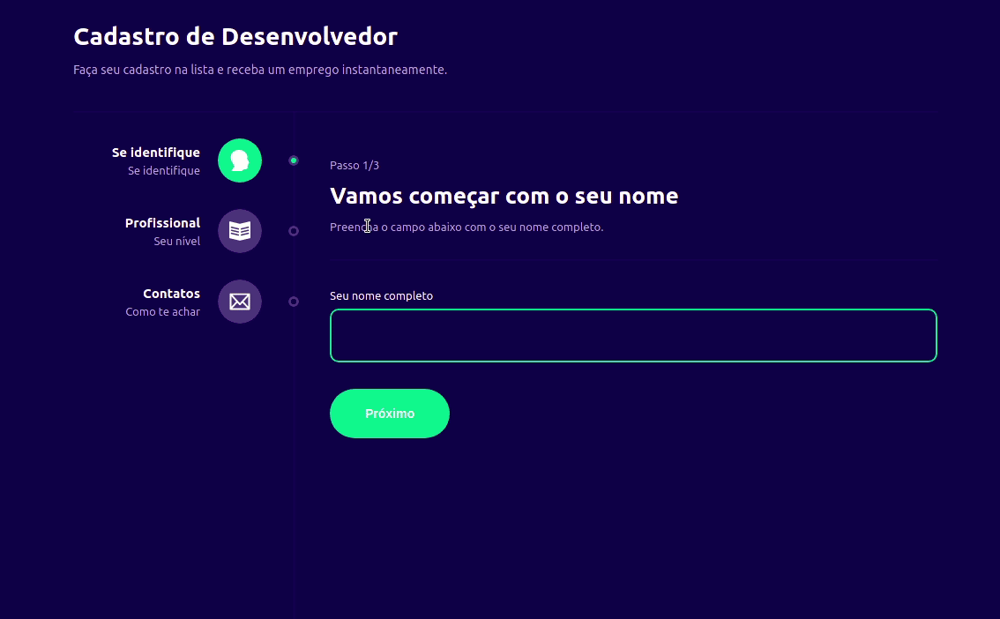

<h1 align="center">Formulário Multi Etapas com Context Api</h1>

Formulário de contato com multi-etapas que salva o estado de cada etapa em um contexto global.

  <h3> Publicado 🚀 </h3>
  <strong><a href="https://form-multi-etapas.vercel.app/">🔗 Clique Aqui para visualizar</a></strong>

# Sumário
-[Funcionalidades](#funcionalidades)  
-[Imagens](#imagens) 
-[Tecnologias](#tecnologias) 
-[Autor](#autor)  

# Funcionalidades
- [x] Compartilhar estado dos campos em contexto global
- [x] Disponibilizar objeto no console do navegador após enviar o formulário

# Imagens

# Tecnologias
As ferramentas utilizadas foram:
<ul style="list-style: none">
  <li>Typescript</li>
  <li>React.Js</li>
  <li>Styled Components</li>
  <li>Context API</li>
</ul>

  <h3> Publicado 🚀 </h3>
  <strong><a href="https://form-multi-etapas.vercel.app/">🔗 Clique Aqui para visualizar</a></strong>

# Autor

<a href="https://github.com/devalexsantos">Alex Santos</a>

